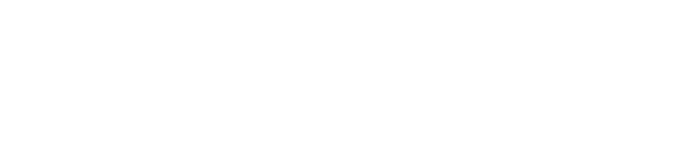

<!-- Improved compatibility of back to top link: See: https://github.com/othneildrew/Best-README-Template/pull/73 -->

<!--  *** Thanks for checking out the Best-README-Template. If you have a suggestion that would make this better, please fork the repo and create a pull request or simply open an issue with the tag "enhancement". Don't forget to give the project a star! Thanks again! Now go create something AMAZING! :D -->

<!-- /// d   u   b   p   i   x   e   l  ---  f   o   r   k   ////--v0.5.6 -->
<!--this has additionally been modifed by @dubpixel for hardware use -->
<!--search dpx_replace_projectName.. search & replace is COMMAND OPTION F -->

<!--this is the version for HARDWARE and SOFTWARE -->
<!--todo add small product image thats not in a details tag -->
<!--igure out how to get the details tag to properly render in jekyll for gihub pages.-->

<!-- PROJECT SHIELDS -->
<!--
*** I'm using markdown "reference style" links for readability.
*** Reference links are enclosed in brackets [ ] instead of parentheses ( ).
*** See the bottom of this document for the declaration of the reference variables
*** for contributors-url, forks-url, etc. This is an optional, concise syntax you may use.
*** https://www.markdownguide.org/basic-syntax/#reference-style-links
***
-->

[![Contributors][contributors-shield]][contributors-url]
[![Forks][forks-shield]][forks-url]
[![Stargazers][stars-shield]][stars-url]
[![Issues][issues-shield]][issues-url]
[![MIT License][license-shield]][license-url]
[![LinkedIn][linkedin-shield]][linkedin-url]

<!-- PROJECT LOGO -->

  
<h1 align="center">dpx_replace_projectName</h1>
<h3 align="center"><i>a sassy project tag line here</i></h3>
  

    ...a short description to tease interest
         
     »  
     <a href="https://github.com/dubpixel/dpx_replace_projectName/tree/main/"><strong>Project Here!</strong></a>
     »  
    <a href="https://github.com/dubpixel/dpx_replace_projectName/tree/main/hardware/src/dpx_replace_projectName/bom"><strong>BOM Here!</strong></a>
     » 
    <a href="https://dubpixel.github.io/dpx_replace_projectName/ibom/index.html"><strong>Interactive BOM Here!</strong></a>
      
    <a href="https://github.com/dubpixel/dpx_replace_projectName/issues/new?labels=bug&template=bug-report---.md">Report Bug</a>
    ·
    <a href="https://github.com/dubpixel/dpx_replace_projectName/issues/new?labels=enhancement&template=feature-request---.md">Request Feature</a>
    

    
<!-- TABLE OF CONTENTS -->

  
<h3>Table of Contents</h3>

<ol>
    <li>
      <a href="#about-the-project">About The Project</a>
      <ul>
        <li><a href="#built-with">Built With</a></li>
      </ul>
    </li>
    <li>
      <a href="#getting-started">Getting Started</a>
      <ul>
        <li><a href="#prerequisites">Prerequisites</a></li>
        <li><a href="#installation">Installation</a></li>
      </ul>
    </li>
    <li><a href="#usage">Usage</a></li>    
    <li><a href="#reflection">Reflection</a></li>
    <li><a href="#roadmap">Roadmap</a></li>
    <li><a href="#contributing">Contributing</a></li>
    <li><a href="#license">License</a></li>
    <li><a href="#contact">Contact</a></li>
    <li><a href="#acknowledgments">Acknowledgments</a></li>
</ol>

<!-- ABOUT THE PROJECT -->

<h3>About The Project</h3>

a lengthy description about the project that should probably be many lines. this is where you can get deep about shit and be like oh man its the best hot dog in the univberse because i use the koskusko mustart!
 

*author(s): // www.dubpixel.tv  - i@dubpixel.tv | other authors* 
 
<h3>Images</h3>

### FRONT
![FRONT][product-front]
### REAR 
![REAR][product-rear]
### FRONT Rendering
![FRONT][product-front-rendering]
### REAR Rendering
![REAR][product-rear-rendering]
### iBOM PCB Front
![iBOM Front][product-pcbFront]
### iBOM PCB Rear
![iBOM Front][product-pcbRear]

(<a href="#readme-top">back to top</a>)

### Built With 
 
 * [![KiCad][KiCad.org]][KiCad-url]
 * [![Fusion360][Fusion-360]][Autodesk-url]
 * [![FastLed][FastLed.io]][FastLed-url]

<!--
 * [![KiCad][KiCad.org]][KiCad-url]
 * [![Fusion360][Fusion-360]][Autodesk-url]
 * [![FastLed][FastLed.io]][FastLed-url]
 * [![Fusion360][Fusion-360]][Autodesk-url]
 * [![Next][Next.js]][Next-url]
 * [![React][React.js]][React-url]
 * [![Vue][Vue.js]][Vue-url]
 * [![Angular][Angular.io]][Angular-url]
 * [![Svelte][Svelte.dev]][Svelte-url]
 * [![Laravel][Laravel.com]][Laravel-url]
 * [![Bootstrap][Bootstrap.com]][Bootstrap-url]
 * [![JQuery][JQuery.com]][JQuery-url]
 
-->

(<a href="#readme-top">back to top</a>)

<!-- GETTING STARTED -->

## Getting Started

  ### Prerequisites
  * 
  ### Installation

  1. 

(<a href="#readme-top">back to top</a>)

<!-- USAGE EXAMPLES -->
## Usage

1. <!-- Use this space to show useful examples of how a project can be used. Additional screenshots, code examples and demos work well in this space. You may also link to more resources.

_For more examples, please refer to the [Documentation](https://example.com)_-->
<!-- REFLECTION -->
## Reflection

* what did we learn? 
  - _x_
* what do we like/hate?
  - _y_
* what would/could we do differently?
  - _z_
  <!-- ROADMAP -->
## Roadmap

- [ ] Feature 1
    - [ ] Nested Feature

See the [open issues](https://github.com/dubpixel/dpx_replace_projectName/issues) for a full list of proposed features (and known issues).

<!-- CONTRIBUTING -->
## Contributing

_Contributions are what make the open source community such an amazing place to learn, inspire, and create. Any contributions you make are **greatly appreciated**._

If you have a suggestion that would make this better, please fork the repo and create a pull request. You can also simply open an issue with the tag "enhancement".
Don't forget to give the project a star! Thanks again!

1. Fork the Project
2. Create your Feature Branch (`git checkout -b feature/AmazingFeature`)
3. Commit your Changes (`git commit -m 'Add some AmazingFeature'`)
4. Push to the Branch (`git push origin feature/AmazingFeature`)
5. Open a Pull Request

### Top contributors:

<!-- LICENSE -->
## License

  Distributed under the UNLICENSE License. See `LICENSE.txt` for more information.
<!-- CONTACT -->
## Contact

  ### Joshua Fleitell - i@dubpixel.tv

  Project Link: [https://github.com/dubpixel/dpx_replace_projectName](https://github.com/dubpixel/dpx_replace_projectName)

<!-- ACKNOWLEDGMENTS -->
## Acknowledgments

<!--
  *  - the best !
-->

(<a href="#readme-top">back to top</a>)

<!-- MARKDOWN LINKS & IMAGES -->
<!-- https://www.markdownguide.org/basic-syntax/#reference-style-links -->
[contributors-shield]: https://img.shields.io/github/contributors/dubpixel/dpx_replace_projectName.svg?style=flat-square
[contributors-url]: https://github.com/dubpixel/dpx_replace_projectName/graphs/contributors
[forks-shield]: https://img.shields.io/github/forks/gdubpixel/dpx_replace_projectName.svg?style=flat-square
[forks-url]: https://github.com/dubpixel/dpx_replace_projectName/network/members
[stars-shield]: https://img.shields.io/github/stars/dubpixel/dpx_replace_projectName.svg?style=flat-square
[stars-url]: https://github.com/dubpixel/dpx_replace_projectName/stargazers
[issues-shield]: https://img.shields.io/github/issues/dubpixel/dpx_replace_projectName.svg?style=flat-square
[issues-url]: https://github.com/dubpixel/dpx_replace_projectName/issues
[license-shield]: https://img.shields.io/github/license/dubpixel/dpx_replace_projectName.svg?style=flat-square
[license-url]: https://github.com/dubpixel/dpx_replace_projectName/blob/main/LICENSE.txt
[linkedin-shield]: https://img.shields.io/badge/-LinkedIn-black.svg?style=flat-square&logo=linkedin&colorB=555
[linkedin-url]: https://linkedin.com/in/jfleitell
[product-front]: images/front.png
[product-rear]: images/rear.png
[product-front-rendering]: images/front_render.png
[product-rear-rendering]: images/rear_render.png
[product-pcbFront]: images/pcb_front.png
[product-pcbRear]: images/pcb_rear.png
[Next.js]: https://img.shields.io/badge/next.js-000000?style=for-the-badge&logo=nextdotjs&logoColor=white
[Next-url]: https://nextjs.org/
[React.js]: https://img.shields.io/badge/React-20232A?style=for-the-badge&logo=react&logoColor=61DAFB
[React-url]: https://reactjs.org/
[Vue.js]: https://img.shields.io/badge/Vue.js-35495E?style=for-the-badge&logo=vuedotjs&logoColor=4FC08D
[Vue-url]: https://vuejs.org/
[Angular.io]: https://img.shields.io/badge/Angular-DD0031?style=for-the-badge&logo=angular&logoColor=white
[Angular-url]: https://angular.io/
[Svelte.dev]: https://img.shields.io/badge/Svelte-4A4A55?style=for-the-badge&logo=svelte&logoColor=FF3E00
[Svelte-url]: https://svelte.dev/
[Laravel.com]: https://img.shields.io/badge/Laravel-FF2D20?style=for-the-badge&logo=laravel&logoColor=white
[Laravel-url]: https://laravel.com
[Bootstrap.com]: https://img.shields.io/badge/Bootstrap-563D7C?style=for-the-badge&logo=bootstrap&logoColor=white
[Bootstrap-url]: https://getbootstrap.com
[JQuery.com]: https://img.shields.io/badge/jQuery-0769AD?style=for-the-badge&logo=jquery&logoColor=white
[JQuery-url]: https://jquery.com 
[KiCad.org]: https://img.shields.io/badge/KiCad-v8.0.6-blue
[KiCad-url]: https://kicad.org 
[Fusion-360]: https://img.shields.io/badge/Fusion360-v4.2.0-green
[Autodesk-url]: https://autodesk.com 
[FastLed.io]: https://img.shields.io/badge/FastLED-v3.9.9-red
[FastLed-url]: https://fastled.io 
